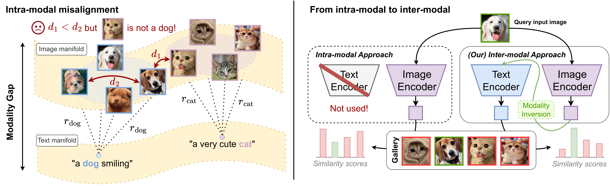

# Cross the Gap (ICLR 2025)
### Exposing the Intra-modal Misalignment in CLIP via Modality Inversion

[](https://openreview.net/forum?id=VVVfuIcmKR)
[](https://github.com/miccunifi/Cross-the-Gap)

This is the **official repository** of the [**ICLR 2025 paper**](https://openreview.net/forum?id=VVVfuIcmKR) 
"*Cross the Gap: Exposing the Intra-modal Misalignment in CLIP via Modality Inversion*" 
by Marco Mistretta, Alberto Baldrati, Lorenzo Agnolucci, Marco Bertini and Andrew David Bagdanov.

## Overview
Pre-trained multi-modal Vision-Language Models like CLIP are widely used off-the-shelf for various applications.  
In this paper, we show that the common practice of individually exploiting the text or image encoders of these powerful multimodal models is highly suboptimal for intra-modal tasks like image-to-image retrieval.
We argue that this is inherently due to the CLIP-style inter-modal contrastive loss, which does not enforce any intra-modal constraints, leading to what we call **intra-modal misalignment**. To demonstrate this, we leverage two optimization-based **modality inversion** techniques that map representations from their input modality to the complementary one without any need for auxiliary data or additional trained adapters.
We empirically show that, in the intra-modal tasks of image-to-image and text-to-text retrieval, approaching these tasks inter-modally significantly improves performance compared to intra-modal baselines on more than fifteen datasets.
Additionally, we demonstrate that approaching a native inter-modal task (e.g., zero-shot image classification) **intra-modally** decreases performance, further validating our findings. Lastly, we show that incorporating an intra-modal term in the pre-training objective or narrowing the modality gap between the text and image feature embedding spaces helps reduce the intra-modal misalignment.



**Left**: The inter-modal contrastive loss used in pretraining enforces paired images and texts to be at a given distance $r$ (e.g., $r_{\text{dog}}$ and $r_{\text{cat}}$) but does not encourage **intra-modal** alignment. Consequently, intra-modal similarity scores might not correspond to those of actual images and texts (e.g., $d_1 < d_2$).
**Right**: We show that the common practice of individually exploiting only one encoder is suboptimal. Approaching intra-modal tasks (e.g., image-to-image retrieval) **inter-modally** via **modality inversion** improves performance.

## Citation
```bibtex
@inproceedings{mistretta2025cross,
  title={Cross the Gap: Exposing the Intra-modal Misalignment in CLIP via Modality Inversion},
  author={Marco Mistretta and Alberto Baldrati and Lorenzo Agnolucci and Marco Bertini and Andrew D. Bagdanov},
  booktitle={The Thirteenth International Conference on Learning Representations},
  year={2025},
  url={https://openreview.net/forum?id=VVVfuIcmKR}
}
```

## Authors
* [**Marco Mistretta**](https://scholar.google.com/citations?hl=it&user=KMIb4eAAAAAJ)**\***
* [**Alberto Baldrati**](https://scholar.google.com/citations?hl=en&user=I1jaZecAAAAJ)**\***
* [**Lorenzo Agnolucci**](https://scholar.google.it/citations?user=hsCt4ZAAAAAJ&hl)**\***
* [**Marco Bertini**](https://scholar.google.it/citations?user=SBm9ZpYAAAAJ&hl=it)
* [**Andrew David Bagdanov**](https://scholar.google.com/citations?user=_Fk4YUcAAAAJ&hl=en)

**\*** Equal contribution.

## Upcoming Release
The code will be released soon, stay tuned!